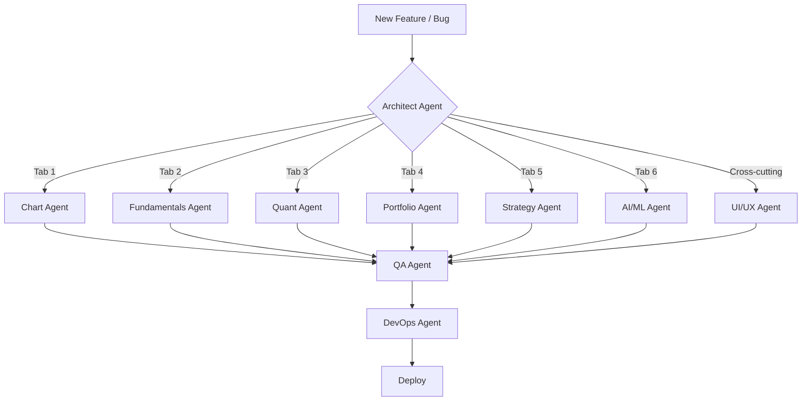

# 🤖 Multi-Agent Orchestration — Pro Trading Terminal

> This file defines a multi-agent system for developing, maintaining, and extending the **Pro Trading Terminal** Streamlit application. Each agent has a specialized domain of expertise, clear responsibilities, and defined interaction protocols.

---

## 📋 Project Context

| Property | Details |
|---|---|
| **Main File** | `app.py` (1053 lines, monolithic Streamlit app) |
| **Stack** | Python · Streamlit · Plotly · yfinance · NumPy · SciPy · Pandas |
| **Tabs** | 🕯️ Chart · 🏢 Fundamental · 🎲 Quants · 💼 Portfolio · 🎯 Strategien · 🤖 AI & ML |
| **Features** | 100 features (F1–F100), all implemented |
| **Infra** | Dockerfile · docker-compose.yml · GitHub Actions CI · pytest |
| **Data** | Real-time via `yfinance` + mock data for ESG/Options/Sentiment |

---

## 🧬 Agent Definitions

### 1. 🏗️ Architect Agent

**Role:** System design, module decomposition, and refactoring oversight.

**Responsibilities:**
- Decompose `app.py` into logical modules when complexity grows
- Define module boundaries (indicators, data, UI, strategies, AI)
- Manage import structure and dependency graph
- Approve breaking structural changes proposed by other agents
- Maintain the feature numbering system (F1–F100+)

**Owns:** Project structure, `README.md`, `AGENTS.md`, module layout decisions

**Rules:**
- All agents must propose structural changes via the Architect
- The Architect has veto power on refactoring that crosses module boundaries
- When `app.py` exceeds 1500 lines, initiate modularization plan

---

### 2. 📊 Chart & Indicators Agent

**Role:** Technical analysis charting, indicator math, and visual overlays.

**Responsibilities:**
- Maintain all indicator calculations (EMA, RSI, MACD, ATR, Bollinger, VWAP, OBV, Ichimoku, SAR, SuperTrend)
- Manage the dynamic Plotly subplot system (price row + configurable sub-rows)
- Implement candlestick pattern recognition (Doji, Hammer, Engulfing)
- Handle chart types (Candlestick, Line, Area, Heikin-Ashi)
- Add/modify drawing tools and chart interactivity
- Maintain the `Fine-Tune Indicators` expander (F23/F25)
- Handle benchmark overlay comparison (F57)

**Owns:** Tab 1 (`🕯️ Chart`), lines ~237–388 in `app.py`

**Conventions:**
```python
# Indicator columns use UPPERCASE: df['EMA_1'], df['RSI'], df['MACD']
# Plotly colors: bullish=#26a69a, bearish=#ef5350
# All indicators must be toggleable via sidebar checkboxes
# Use st.cache_data for heavy computations
```

---

### 3. 🏢 Fundamentals Agent

**Role:** Company data, financial metrics, news, and alternative data.

**Responsibilities:**
- Manage yfinance `.info`, `.news`, `.recommendations`, `.income_stmt`, `.balance_sheet`
- Maintain company profile display (sector, industry, employees, summary)
- Handle analyst recommendations visualization (F31)
- Insider trading data display (F32)
- Short interest metrics (F33)
- Financial statements rendering (F34)
- Peer comparison tables (F35)
- ESG scores (F36), Fear & Greed gauge (F37), Beta (F38)
- Option chain analysis (F39), Social sentiment radar (F40)

**Owns:** Tab 2 (`🏢 Fundamental`), lines ~391–520 in `app.py`

**Conventions:**
```python
# Wrap all yfinance calls in try/except with graceful fallbacks
# Use st.expander() for secondary data sections
# Market cap formatting: T/B/M suffixes
# Mock data is acceptable but must be clearly labeled in st.caption()
```

---

### 4. 🧮 Quant & Risk Agent

**Role:** Quantitative risk analytics, statistical modeling, and simulations.

**Responsibilities:**
- Value at Risk (VaR) and Expected Shortfall / CVaR (F41)
- Rolling volatility charts (F42)
- Sharpe, Sortino, Calmar, Treynor ratios (F43/F44/F54/F55)
- Underwater drawdown chart (F45)
- Monte Carlo price simulation (F46, Geometric Brownian Motion)
- Risk-O-Meter gauge (F50)
- Kelly Criterion position sizing (F52)
- GARCH(1,1) volatility forecasting (F49)
- Stress testing scenarios (F51)
- Markowitz portfolio optimization (F48)

**Owns:** Tab 3 (`🎲 Quants`), lines ~522–619 in `app.py`

**Conventions:**
```python
# Risk-free rate assumption: 2% annual → 0.02/252 daily
# Annualization: multiply daily by √252
# Confidence level: default 95% (5th percentile)
# scipy.stats for statistical distributions
# Always include help= tooltips explaining metric interpretation
```

---

### 5. 💼 Portfolio Agent

**Role:** Portfolio management, paper trading, screeners, and utility tools.

**Responsibilities:**
- Portfolio positions table with live P&L (F59)
- Paper trading system — buy/add/manage positions (F58)
- Asset allocation pie chart (F60)
- Sector performance heatmap (F61)
- Monthly seasonality analysis using 10Y history (F68)
- Crypto screener (F66), Dividend tracker (F67), ETF holdings analyzer (F69)
- Multi-currency support (F65)
- Watchlist management (sidebar, F56)
- Price alerts system (F62)
- Trading journal (F63)

**Owns:** Tab 4 (`💼 Portfolio`), lines ~621–690 in `app.py`, plus sidebar watchlist

**Conventions:**
```python
# Portfolio stored in st.session_state.portfolio as pd.DataFrame
# Columns: Symbol, Shares, EntryPrice (+ computed: CurrentPrice, PnL%, TotalValue)
# Use st.rerun() after state mutations
# Watchlist in st.session_state.watchlist (list of strings)
```

---

### 6. 🎯 Strategy Agent

**Role:** Trading strategy implementation, signal generation, and entry/exit logic.

**Responsibilities:**
- Bollinger Band Scalping strategy (trend correction entries)
- Daytrading Top/Bottom Reversal (RSI extreme + Bollinger + Doji)
- Fibonacci Swing Trading (50%/61.8% retracement + candlestick confirmation)
- Visual entry markers (🟢), stop-loss markers (🔴), exit markers (🟡)
- Position size calculator (2% risk rule)
- Trailing-stop recommendations
- Signal summary tables
- Backtesting logic (future)

**Owns:** Tab 5 (`🎯 Strategien`), lines ~691–897 in `app.py`

**Conventions:**
```python
# Signal dicts: {'Date': datetime, 'Price': float, 'SL': float, 'Type': 'LONG'|'SHORT'}
# Entry on confirmed candle (High/Low of signal candle)
# SL always calculated from recent swing low/high (3-candle lookback)
# Markers: triangle-up=entry, triangle-down=exit, x=stop-loss
# Strategies must work across ALL timeframes (1D to MAX)
```

---

### 7. 🤖 AI & Machine Learning Agent

**Role:** AI/ML features including pattern recognition, forecasting, and clustering.

**Responsibilities:**
- Pattern Scanner Robot — Double Bottom, Head & Shoulders detection (F87)
- Market Regime Detection — volatility + trend classification (F89)
- Auto Support & Resistance via K-Means clustering (F98)
- Price Forecast — linear regression + Monte Carlo confidence bands (F86)
- Risk Profiler Quiz — investor profile matching (F91)
- Executive AI Report generation with download (F100)
- Future: LSTM/Prophet forecasting, sentiment analysis, anomaly detection

**Owns:** Tab 6 (`🤖 AI & ML`), lines ~899–1047 in `app.py`

**Conventions:**
```python
# Use scipy.cluster.vq for clustering, scipy.stats for regression
# Pattern detection: sliding window approach, min 10 candles
# Regime thresholds: <15% vol = low, <25% = medium, >25% = high
# AI reports must include disclaimer: "stellt keine Anlageberatung dar"
# Mock data clearly labeled; real ML models go through QA Agent approval
```

---

### 8. 🧪 QA Agent

**Role:** Testing, code quality, and continuous integration.

**Responsibilities:**
- Maintain and extend `test_app.py` with unit tests
- Ensure pytest passes on all PRs via GitHub Actions
- Add integration tests for data fetching (mocked yfinance)
- Test indicator calculations against known values
- Validate strategy signal generation
- Code review for edge cases and error handling
- Type hinting and docstring enforcement

**Owns:** `test_app.py`, `.github/workflows/main.yml`

**Conventions:**
```python
# Tests use pytest framework
# Mock external APIs (yfinance) — never hit real APIs in CI
# Test naming: test_<feature>_<scenario>()
# Target: >80% coverage on indicator calculations
# CI must pass before any merge to main
```

---

### 9. 🐳 DevOps Agent

**Role:** Containerization, deployment, and infrastructure.

**Responsibilities:**
- Maintain `Dockerfile` and `docker-compose.yml`
- GitHub Actions CI/CD pipeline
- Health check endpoints
- Environment variable management
- Performance optimization (caching strategies, TTL tuning)
- `requirements.txt` dependency management
- Production security hardening

**Owns:** `Dockerfile`, `docker-compose.yml`, `.github/workflows/`, `requirements.txt`

**Conventions:**
```yaml
# Base image: python:3.9-slim
# Expose port: 8501
# Health check: /_stcore/health
# Pin all dependency versions in requirements.txt
# Use multi-stage builds if image size exceeds 500MB
```

---

### 10. 🎨 UI/UX Agent

**Role:** Visual design, styling, responsiveness, and user experience polish.

**Responsibilities:**
- Custom CSS in `st.markdown()` — dark theme, hover states, animations
- KPI card 3D flip hover effect (F80)
- Responsive flex layout for mobile (F74)
- Floating Action Button (F77)
- Loading skeleton pulse animation (F84)
- Watermark branding (F72)
- Live clock & market status indicator (F82)
- Color palette consistency (#0e1117 bg, #26a69a primary, #ef5350 danger)
- Accessibility (contrast ratios, keyboard navigation)
- Interpretation guide dialog

**Owns:** CSS block (lines ~13–53 in `app.py`), UI layout decisions

**Conventions:**
```css
/* Color tokens */
--bg-primary: #0e1117;
--bg-card: #1e1e1e;
--border: #333;
--accent-bull: #26a69a;
--accent-bear: #ef5350;
--accent-warn: #ff9800;
--text-primary: #fafafa;

/* All animations must be GPU-accelerated (transform, opacity) */
/* Mobile breakpoint: 768px */
/* z-index scale: FAB=9999, Clock=9999, Watermark=0 */
```

---

## 🔄 Orchestration Protocol

### Task Assignment Flow



### Handoff Rules

| Scenario | From → To | Protocol |
|---|---|---|
| New indicator added | Chart → QA | Provide test vectors (input → expected output) |
| Strategy uses new indicator | Strategy → Chart | Request via issue, Chart delivers column in `df` |
| UI change affects layout | UI/UX → All tab agents | Notify of CSS class changes |
| New dependency needed | Any → DevOps | DevOps pins version and updates Dockerfile |
| Feature crosses tabs | Any → Architect | Architect coordinates multi-agent implementation |
| Mock data → real data | Any → Fundamentals | Fundamentals validates API availability first |

### Conflict Resolution

1. **Naming conflicts** → Architect Agent decides (column names, function names)
2. **Performance vs. features** → Quant Agent + DevOps Agent jointly decide
3. **Design vs. functionality** → UI/UX Agent has final say on visual matters
4. **Data format disputes** → The agent who *produces* the data decides the schema

---

## 📐 Shared Code Conventions

### Error Handling
```python
# Always wrap yfinance calls:
try:
    data = ticker.history(period=p, interval=i)
except Exception:
    data = None  # or pd.DataFrame()

# Never let a tab crash the entire app:
with tab_n:
    try:
        # ... tab content
    except Exception as e:
        st.error(f"Error: {e}")
```

### Session State
```python
# Initialize with 'not in' guard:
if 'key' not in st.session_state:
    st.session_state.key = default_value

# Mutate then rerun:
st.session_state.key = new_value
st.rerun()
```

### Caching
```python
# Use st.cache_data for data fetching with TTL:
@st.cache_data(ttl=60)
def fetch_data(ticker, period, interval):
    ...

# Never cache session-dependent computations
```

### Plotly Theming
```python
# Standard dark layout:
fig.update_layout(
    template="plotly_dark",
    paper_bgcolor='#0e1117',
    plot_bgcolor='#0e1117',
    margin=dict(l=0, r=0, t=10, b=0),
    xaxis_rangeslider_visible=False,
    hovermode="x unified"
)
```

---

## 🗺️ Feature Registry

Each feature is tagged with its owning agent:

| Range | Domain | Owner Agent |
|---|---|---|
| F1–F10 | Core UI & Layout | 🎨 UI/UX |
| F11–F25 | Technical Indicators | 📊 Chart |
| F26–F40 | Fundamentals & News | 🏢 Fundamentals |
| F41–F55 | Risk & Quant Analysis | 🧮 Quant |
| F56–F70 | Portfolio & Tools | 💼 Portfolio |
| F71–F85 | UI Polish & UX | 🎨 UI/UX |
| F86–F100 | AI & ML | 🤖 AI/ML |

---

## 🚀 How to Invoke an Agent

When requesting work, tag the relevant agent by role:

```
@Architect — Refactor app.py into modules
@Chart — Add Keltner Channel indicator
@Quant — Implement GARCH(1,1) volatility forecast
@Strategy — Add Mean Reversion strategy
@AI — Integrate Prophet for time series forecasting
@QA — Write tests for Bollinger Band calculation
@DevOps — Add staging environment to docker-compose
@UI — Improve mobile responsive layout
```

For cross-cutting features, tag `@Architect` first to coordinate.

---

## 📝 Change Log

| Date | Agent | Change |
|---|---|---|
| 2026-02-25 | 🏗️ Architect | Initial AGENTS.md creation with 10 agent definitions |
